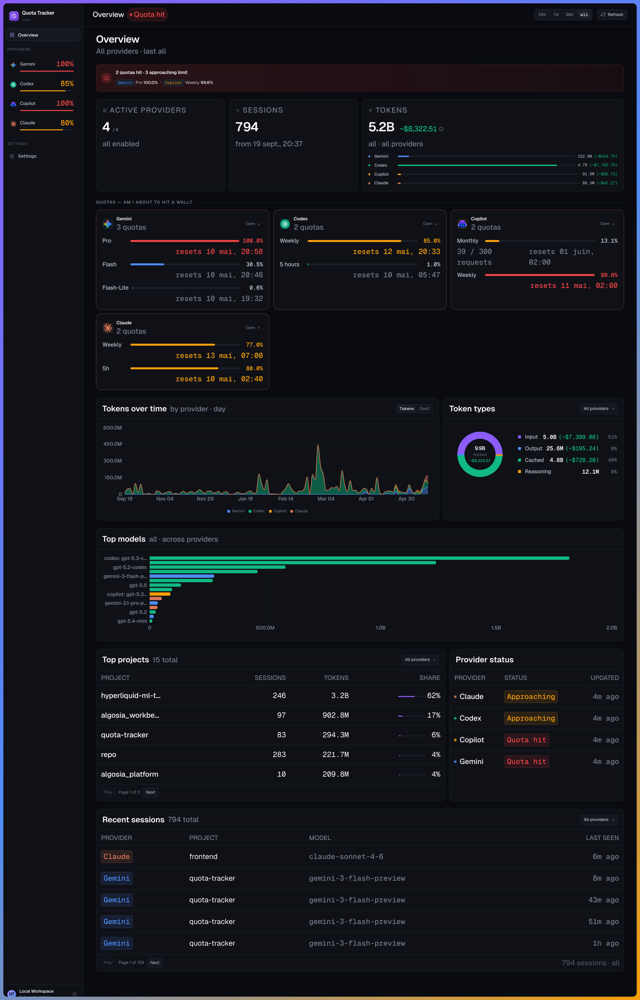

# quota-tracker

Track token usage and quotas for [Claude](https://claude.ai), [Copilot](https://github.com/features/copilot), [Codex](https://openai.com/codex) and [Gemini](https://gemini.google.com) — locally, with no telemetry.

**Zero configuration required.** Quota Tracker automatically leverages your existing local CLI credentials to fetch real-time quotas. It parses and backfills your conversation history into a local database, ensuring your usage data is persisted and searchable even after a local environment cleanup.

<p align="center">
  <a href="https://github.com/Thomas97460/quota-tracker/actions/workflows/ci.yml">
    
  </a>
  <a href="https://github.com/Thomas97460/quota-tracker/releases/latest">
    
  </a>
  <a href="https://github.com/Thomas97460/quota-tracker/actions/workflows/ci.yml">
    
  </a>
  <a href="https://github.com/Thomas97460/quota-tracker/actions/workflows/ci.yml">
    
  </a>
  <a href="https://github.com/Thomas97460/quota-tracker/actions/workflows/ci.yml">
    
  </a>
  <a href="https://github.com/Thomas97460/quota-tracker/actions/workflows/ci.yml">
    
  </a>
  <a href="https://www.python.org/">
    
  </a>
</p>

## Quick start (Linux)

```bash
curl -fsSL https://raw.githubusercontent.com/Thomas97460/quota-tracker/main/install.sh | bash
```

Installs the binary, runs migrations, backfills history and starts a systemd user service. Open the printed URL when done.

<div align="center">

</div>

## Uninstall

```bash
curl -fsSL https://raw.githubusercontent.com/Thomas97460/quota-tracker/main/uninstall.sh | bash
```

The uninstall helper asks before removing the systemd user service, then asks separately before deleting the local SQLite database.
